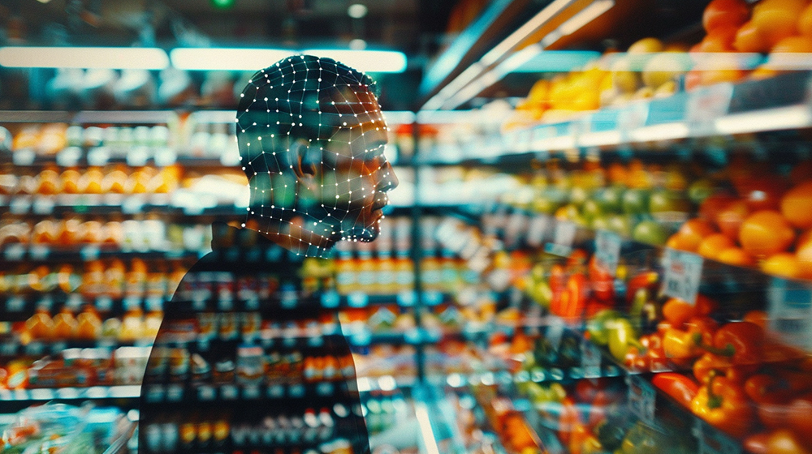
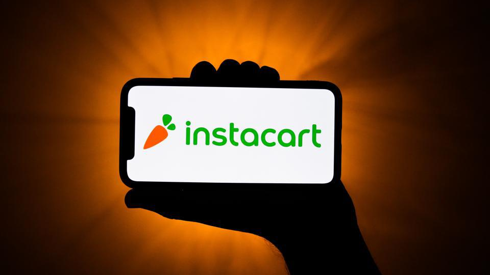

# Instacart Market Basket Analysis and Association Rules


Credits: [Grocey Doppio](https://www.grocerydoppio.com/articles/the-transformative-power-of-ai-in-personalizing-the-grocery-shopping-experience)

<a href="https://www.python.org/">
    
</a>
<a href="https://pandas.pydata.org/">
    
</a>
<a href="https://numpy.org/">
    
</a>
<a href="https://matplotlib.org/">
    
</a>
<a href="https://seaborn.pydata.org/">
    
</a>
<a href="#">
    
</a>
<a href="https://scikit-learn.org/">
    
</a>
<a href="#">
    
</a>
<a href="#">
    
</a>
<a href="https://github.com/rasbt/mlxtend">
    
</a>
<a href="https://github.com/yangshun/market-basket-analysis/blob/master/README.md">
    
</a>
<a href="https://plotly.com/python/">
    
</a>

**Project description:** In this project we explore how a market basket analysis can be used to analyze a online grocery dataset from Instacart, customer behaviors and provide simple purchase recommendations using association rules and the a priori algorithm   

We will describe the analysis and findings by clearly connecting the business questions to the data used

---

## Background: What Is Market Basket Analysis and What Can It Be Used For ?

Market basket analysis is a set of statistical affinity calculations that help managers better understand and  serve their customers by identifying purchase patterns. In simplest terms, this type of analysis shows what combinations of products most frequently occur together in orders. These relationships can then be used to increase profitability through cross-selling, recommendations, promotions, or even the placement of items on a menu or in a store.  

The key business use cases and benefits of Market Basket Analysis are to:
  * Identify customers purchases and patterns
  * Improve customer purchasing experience
  * Improve product placement
  * Up-sell / Cross-sell

  We will use this method to analyze a retail dataset from Kaggle.   

  ## 1. The Instacart Online Grocery Shopping Dataset (Kaggle)


Credits: [Forbes](https://www.forbes.com/advisor/investing/instacart-ipo/)
  
The Instacart Online Grocery Shopping Dataset is an anonymized dataset containing a sample of over 3 million grocery orders from more than 200,000 Instacart users.
  
  The data can be accessed on Kaggle [here](https://www.kaggle.com/datasets/yasserh/instacart-online-grocery-basket-analysis-dataset)
  

  We will be using the following tables from the dataset to perform our analysis: 

  - **orders**
    * 3.4 M unique orders
    * 206 k unique customers
    * On average 11 days occur between each order
    * 10am and 1-3pm are the time of day during which the most customer orders occur
    * 0: 'Monday' and 1: 'Tuesday' are the days of the week during which the most customer orders occur
  ```
    order_id: order identifier
    user_id: customer identifier
    eval_set: which evaluation set this order belongs in (see SET described below)
    order_number: the order sequence number for this user (1 = first, n = nth)
    order_dow: the day of the week the order was placed on
    order_hour_of_day: the hour of the day the order was placed on
    days_since_prior: days since the last order, capped at 30 (with NAs for order_number = 1)   
  ```

  - **products**
    * Close to 50k unique products
    * 10% of products seem to be organic
  ```
  product_id: product identifier
  product_name: name of the product
  aisle_id: foreign key
  department_id: foreign key
  ```

  - **aisles**
    * 134 unique aisle descriptions  
  ```
  aisle_id: aisle identifier
  aisle: the name of the aisle
  ```

  - **deptartments**
    * 21 departments 
  ```
  department_id: department identifier
  department: the name of the department
  ```

  - **order_products**
    * 1.3 M product orders combination from customers
    * 130 k unique orders
    * 40 k unique products purchased
  ``` 
  order_id: foreign key
  product_id: foreign key
  add_to_cart_order: order in which each product was added to cart
  reordered: 1 if this product has been ordered by this user in the past, 0 otherwise
  where SET is one of the four following evaluation sets (eval_set in orders):
  ```
---
## 2. Interesting Topics To Analyze and Questions to Answer About Instacart's Grocery Dataset

Now that we are a bit more familiar with the Instacart grocery dataset, let's plan to investigate the following questions:
  * Which are the most popular items purchased ? Which are the least ?
  * What does the distribution of the products purchased look like ?
  * Do customers purchase items together frequently and which products are most often purchased together ?
  * Can we use this information to recommend other products based on a customer’s cart ?

---
## 3. Process, analyze, model and visualize the data to answer the above questions
  
  In this project and the following jupyter notebooks, we largely follow the CRISP-DM process :
  * **Business understanding** - refer to the Market Basket Analysis background information section above

  * **Data preparation & understanding** \
      We start by loading the data, inspecting and profiling it and checking for quality issues.
      We then perform some EDA and visualize inspect the Instacart retail data

      Refer to the following notebook [here](1-BasketAnalysis-DataPreparationandUnderstanding.ipynb)

  * **Deliver Insights** \
      In the analysis notebook we focus on using the preprocessed data to answers the key business questions listed and some customer purchase patterns

      Refer to the following notebook [here](2-BasketAnalysis-DeliverInsights&Modeling.ipynb)

  * **Modeling & Evaluation / Deployment** \
      In the modeling notebook we finalize our analysis by modelling the data and using Association Rules to build a simple recommendation engine based on the customer p[urchase patterns

      Refer to the following notebook [here](2-BasketAnalysis-DeliverInsights&Modeling.ipynb)

---
## 4. Providing Insights and Identifying Customer Purchase Patterns using Market Basket Analysis 
  
  ## Which are the most popular items purchased ? Which are the least ? 
  
  By far, bananas are the most popular product purchased, followed by Strawberries and Spinach

  <kbd>  </kbd>
  
  The majority of the top 20 most popular products are organic - it seems that Instacart customers like fresh and healthy products
  ```
  Banana                    18,726
  Bag of Organic Bananas    15,480
  Organic Strawberries      10,894
  Organic Baby Spinach       9,784
  Large Lemon                8,135
  Organic Avocado            7,409
  Organic Hass Avocado       7,293
  Strawberries               6,494
  Limes                      6,033
  Organic Raspberries        5,546
  Organic Blueberries        4,966
  Organic Whole Milk         4,908
  Organic Cucumber           4,613
  Organic Zucchini           4,589
  Organic Yellow Onion       4,290
  Organic Garlic             4,158
  Seedless Red Grapes        4,059
  Asparagus                  3,868
  Organic Grape Tomatoes     3,823
  Organic Red Onion          3,818
```
  This is confirmed by looking at the most popular aisles with the top two: fresh vegetables and fresh fruits 

  <kbd>  </kbd>

  On the other hand, there is a long list of products that have been purchased only once, these represents about 20% (8k) of the unique product list purchased. Here is sample from that list:
```
Lucuma & Cacoa Chocolate Bar 
Organic Nori Rice Cakes No Salt                             
Wheat and Gluten Free Snickerdoodle Cookies                 
Sweet Basil                                                 
Handcrafter French Pot Ice Cream Buckeye Chocolate Chip     
Cereal, Veganic Sprouted, Spelt Flakes                      
Shrimp Ring                                                 
Plain Kefir                                                 
Dark Chocolate Truffles                                     
Itsy Bitsy Cheese Ravioli                                   
Prenatal Multivitamin Tablets                               
```   
  The least popular products belong to aisles that are mostly non-food related such as baby bath body care, baby accessories, beauty etc.
``` 
first aid                     
skin care                     
shave needs                   
ice cream toppings            
specialty wines champagnes    
kitchen supplies              
baby bath body care           
baby accessories              
frozen juice                  
beauty                                                   
```   

  ## What does the distribution of the products purchased look like ? 

  [Interactive Plotly Chart](graphs/item_frequency.html)

  <kbd>  </kbd>

  From the chart above we can quickly identify that product purchase frequency drops significantly after the top 1000 ranked products (around the 50 percentile of product count) and organic and fresh products are by far the most popular products

  <kbd>   </kbd>
  The distribution is right skewed with a long tail and a mode of 1 for product purchased count  
  
  ## Do customers purchase items together frequently ? 

  [Interactive Plotly Chart](graphs/user_purchase_frequency.html)

  <kbd>  </kbd>
  
  About 4k users have purchase 30 products or more with one user having purchase 80 products in a single order. After that threshold passed, the curve flattens quickly for the rest of the 100k+ users

  <kbd>  </kbd>
  
  The distribution is right skewed with a long tail and a mode of 5 product purchase per use

  ## Which products are most often purchased together ? 
  To answer this question, we turn to association rules that uncover how items are associated to each other.

  > Association rules are created by searching data for frequent if-then patterns and using the criteria support and confidence to identify the most important relationships. 
  >
  > * **Support** is an indication of how frequently the items appear in the data, measured by the proportion of transactions in which an item appears.
  > 
  > * **Confidence** indicates the number of times the if-then statements are found true. How likely item Y is purchased when item X is purchased, expressed as {X -> Y} 
  >
  > * **Lift** is the ratio of the observed support to that expected if X and Y were independent. A lift value greater than 1 means that item Y is likely to be bought if item X is bought.

  **How to interpret association rules:** \
  The rule **{onions, potatoes} => {burger}** found in the data would indicate that if a customer buys onions and potatoes together, they are likely to also buy hamburger meat with onions,potatoes} called **antecedent** and {burger} the **consequent**

  We used an implementation of the a [priori algorith](https://www.geeksforgeeks.org/apriori-algorithm/) in the mlxtend libary to analyze the Istacart purchased items associations. More information about the library may be found [here](http://rasbt.github.io/mlxtend/user_guide/frequent_patterns/apriori/)

  We apply the a priori algorithm to a binary matrix of filtered orders and products in which for each order is a row and each column a product with 1 signifying that the product was present in the order and 0 if it wasn't. It is a sparse matrix. In the Jupter notebook the shape of the matrix is :
  ```  
  # 2,499 rows (orders) x 17,085 columns (products)
  (2499, 17085) 
  ``` 

  The algorithm outputs association rules identified in the data - these are ordered by descending order of lift scores:

  <kbd>  </kbd>

  If we visualize the association rules using a heatmap of the lift metrics, we can easily identify the items with strongest association lift scores: 

  <kbd>  </kbd>

  We can identify that Organic Garlic, Bag of Organic Bananas and Organic Yellow Onion have the strongest relationship. \
  Another example include Organic Has Avocado, Organic Strawberries and Organic Lemon.

  ## Can we use this information to recommend other products based on a customer’s cart ?

  **Yes !** By tuning and specific lift/support/confidence thresholds, we can  recommend items based on existing customer shopping carts:

  As an example with one item in the cart:
   ```  
  "frozenset({'Organic Garlic'})=>frozenset({'Organic Yellow Onion'})"
  ``` 

  As an example with two items in the cart:
   ```  
  frozenset({'Organic Lemon', 'Bag of Organic Bananas'})=>frozenset({'Organic Hass Avocado'})
  ```

---
## Conclusion
* Through the application of association rule mining, we have successfully identified patterns in customer purchasing behavior, revealing which products are frequently bought together. This insight allows us to better understand product affinities and co-purchase trends.

* Moreover, by utilizing the Apriori model, we can now offer personalized product recommendations to Instacart customers. Based on the items already in their cart, we can suggest complementary products, enhancing the shopping experience and potentially increasing overall basket size. This data-driven approach not only improves customer satisfaction but also offers a valuable tool for increasing sales and optimizing product offerings.